# 26 Best Customer Service Software Platforms in 2025

Managing customer support shouldn't feel like playing email whack-a-mole across fifteen different channels while your team drowns in repetitive questions and your customers wait hours for basic answers. Whether you're a growing startup handling your first hundred support tickets, an e-commerce brand juggling returns across multiple platforms, or an enterprise team coordinating hundreds of agents globally, the right customer service software transforms chaos into manageable workflows that actually make customers happy.

The help desk landscape has moved way beyond basic ticketing systems. Modern platforms bring together live chat, email, social media, phone, and messaging apps into unified inboxes where agents see complete customer histories, AI handles routine questions automatically, and automation routes complex issues to specialists without manual sorting. Some specialize in e-commerce with deep Shopify integrations, others excel at B2B with robust CRM connections, and a few just make multichannel support feel effortless instead of overwhelming.

## **[Zendesk](https://www.zendesk.com)**

Complete customer service platform unifying conversations across channels with AI-powered automation and agent tools designed for teams of all sizes.

Zendesk built its reputation on reliable ticketing that scales from five-person startups to enterprise operations supporting millions of customers. The platform brings email, chat, phone, social media, and messaging into a unified workspace where agents see complete customer context without switching tabs. The ticketing system automatically prioritizes urgent issues, routes requests to appropriate agents based on skills and availability, and tracks everything through customizable workflows.

AI capabilities have expanded significantly—the platform resolves common questions automatically from day one by learning from your help center articles and previous resolutions. Agents get AI-suggested responses that they can edit and send, speeding up reply times while maintaining personal touch. The macro system lets teams create templated responses for frequent questions, and triggers automate repetitive tasks like sending follow-ups or escalating overdue tickets.

The reporting dashboard provides real-time visibility into team performance, customer satisfaction scores, resolution times, and ticket volumes across channels. Custom views let agents organize their queues however makes sense for their workflow. Integration marketplace includes hundreds of apps connecting to CRMs, e-commerce platforms, communication tools, and business systems.

Zendesk Support Suite bundles ticketing, messaging, live chat, voice, and help center starting around $55 per agent monthly, with higher tiers adding advanced AI, custom roles, and enhanced reporting. The platform works for small teams needing basic ticketing and enterprises requiring sophisticated routing with hundreds of agents. Setup complexity increases with feature depth—basic configurations launch quickly while advanced customization benefits from implementation support.

## **[Freshdesk](https://freshdesk.com)**

Scalable help desk with powerful automation, AI-powered agent assistance, and generous free tier supporting up to 10 agents.

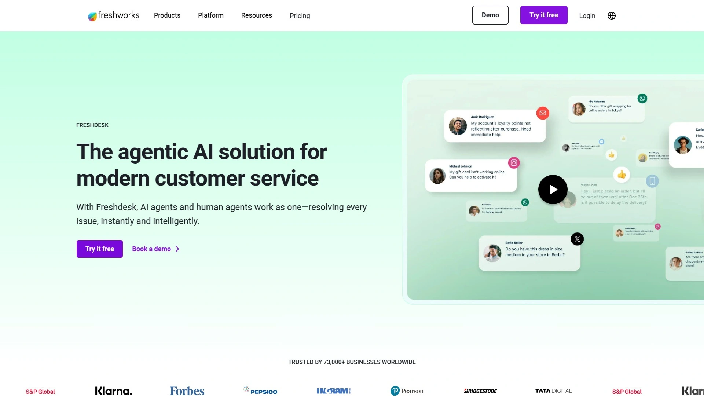

Freshdesk delivers comprehensive ticketing with automation that handles high volumes efficiently. The free plan includes ticketing across email and social channels, knowledge base creation, team collaboration, and analytics for up to 10 agents—genuinely useful capacity that many small teams operate within permanently. Paid tiers add live chat, phone support, advanced automation, and AI features without dramatic price jumps.

Freddy AI provides agent assistance that summarizes tickets, suggests responses, analyzes sentiment, and generates knowledge base articles from resolved tickets. The self-service widgets guide customers to relevant help center answers before creating tickets, reducing agent workload. Automated ticket routing uses business rules to send requests to appropriate agents based on criteria you define.

The multichannel support covers email, chat, phone, WhatsApp, Facebook, Twitter, and more platforms than many competitors. Unified ticketing means regardless of where customers contact you, agents see the complete conversation history. Collaborative features like shared ownership, private notes, and parent-child ticket linking help teams coordinate on complex issues.

Day Passes add occasional agent access without full license costs, valuable for handling seasonal spikes or bringing in specialized staff temporarily. Integration ecosystem connects to major business tools, and the platform's REST API enables custom connections. Reporting includes trends, forecasting, and team performance metrics. For budget-conscious teams wanting scalable automation with strong multichannel coverage, Freshdesk balances capability and affordability effectively.

## **[Intercom](https://intercom.com)**

Conversational support platform combining live chat, bots, product tours, and targeted messaging for modern customer engagement.

Intercom approaches support as ongoing conversation rather than discrete tickets, building relationships through messaging that feels natural. The Messenger widget lives on your site and app, enabling customers to start conversations that agents continue across sessions with full context. Bots handle routine questions automatically, qualifying issues before handing off to humans when needed.

Product tours and targeted messages proactively guide users through features, answer questions before they're asked, and drive adoption of new capabilities. This proactive approach reduces support volume by helping customers succeed independently. The platform segments customers based on behavior, properties, and history, enabling personalized messaging that feels relevant rather than generic.

The unified inbox shows customer data, conversation history, and relevant context alongside messages, helping agents provide informed responses quickly. Team collaboration features like assignments, mentions, and internal notes keep everyone coordinated. Reporting tracks conversation volume, resolution times, customer satisfaction, and bot performance.

Integration with marketing and sales tools creates continuity across the customer journey—sales context informs support conversations, and support insights flow to sales teams. The visual workflow builder creates custom bots and automated sequences without coding. Pricing reflects the comprehensive feature set, positioning it higher than basic ticketing systems but delivering more than simple help desks. For product-led companies wanting to blend support with proactive engagement, Intercom offers capabilities that traditional help desks lack.

## **[HubSpot Service Hub](https://hubspot.com/products/service)**

CRM-integrated service platform combining ticketing, knowledge base, and customer feedback with seamless connections to sales and marketing data.

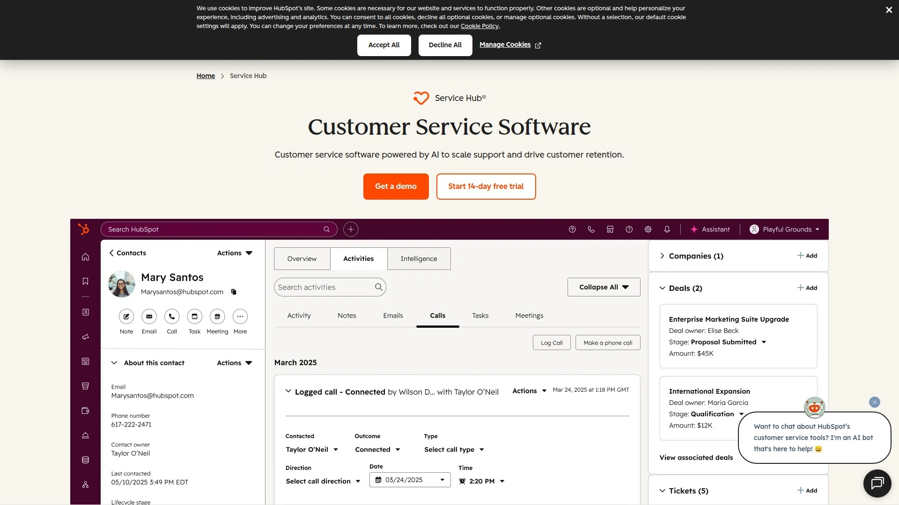

HubSpot Service Hub leverages the company's CRM foundation to provide support with complete customer context from sales, marketing, and previous service interactions. Agents see deal stages, marketing engagement, and purchase history alongside support tickets, enabling personalized responses that reference relevant customer information. For companies already using HubSpot for sales or marketing, Service Hub extends that ecosystem without integration friction.

Ticket pipelines work like sales pipelines, letting you customize statuses and workflows matching your support processes. Automated routing, canned responses, team collaboration, and SLA management handle standard help desk needs. The conversation inbox unifies email, live chat, Facebook Messenger, and forms into one view. Knowledge base tools help you build self-service resources that reduce ticket volume.

Customer feedback features including NPS and CSAT surveys automatically solicit feedback after interactions, tracking satisfaction trends over time. The reporting dashboard shows team productivity, customer happiness, and support performance alongside sales and marketing metrics for unified business visibility. The free tier includes ticketing, live chat, limited automation, and shared inbox for up to five agents.

Phone support is built-in from the Starter plan without requiring third-party integration, valuable for teams where voice remains important. For e-commerce businesses, integration with Commerce Hub provides order data directly in support conversations. The platform works especially well for companies wanting unified tools for marketing, sales, and service rather than best-of-breed point solutions. Setup familiarity benefits existing HubSpot users while new adopters face learning curve spanning the broader platform.

## **[Salesforce Service Cloud](https://salesforce.com/service/)**

Enterprise service platform with AI-powered automation, omnichannel routing, and deep integration with Salesforce's business ecosystem.

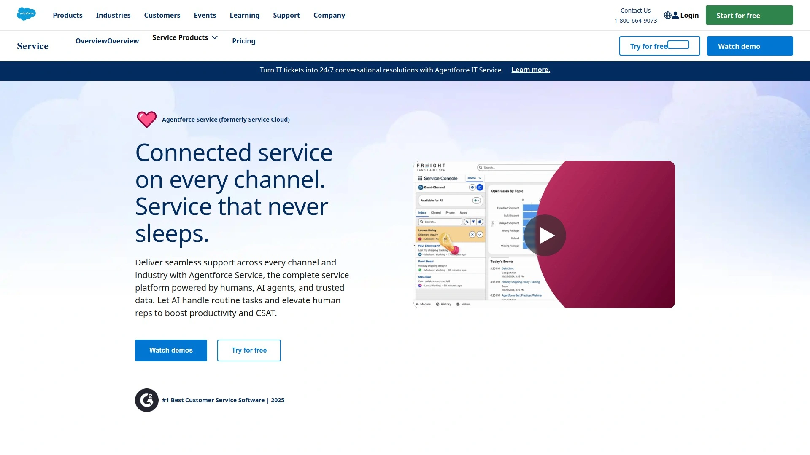

Salesforce Service Cloud targets enterprises needing sophisticated automation, extensive customization, and integration with complex business systems. The platform handles service at massive scale—routing thousands of cases across hundreds of agents with AI-driven prioritization and workflow automation. Einstein AI predicts case fields, recommends solutions, and automates responses for routine inquiries.

Omnichannel routing intelligently distributes work across email, phone, chat, messaging, and social media based on agent skills, capacity, and availability. The console interface provides agents with complete case context, customer history, and relevant knowledge articles in unified views. Service processes can be customized extensively using Salesforce's process builder and workflow tools.

Integration with Sales Cloud, Marketing Cloud, and Commerce Cloud creates unified customer views spanning the entire relationship. Field service capabilities coordinate on-site technicians with support teams. The mobile app enables agents to handle cases from anywhere. AppExchange marketplace includes thousands of pre-built integrations and extensions.

Implementation complexity and cost reflect enterprise positioning—expect significant setup time, potential developer involvement, and pricing that scales with feature usage. Licensing includes per-user fees plus additional costs for add-ons like AI features, premium chat, and advanced analytics. For large organizations already invested in Salesforce ecosystem or needing enterprise-grade service management, Service Cloud delivers comprehensive capability. Smaller teams often find it overcomplicated and overpriced for basic needs.

## **[Gorgias](https://gorgias.com)**

E-commerce-focused helpdesk with deep Shopify integration, enabling agents to manage orders, refunds, and customer data directly from support conversations.

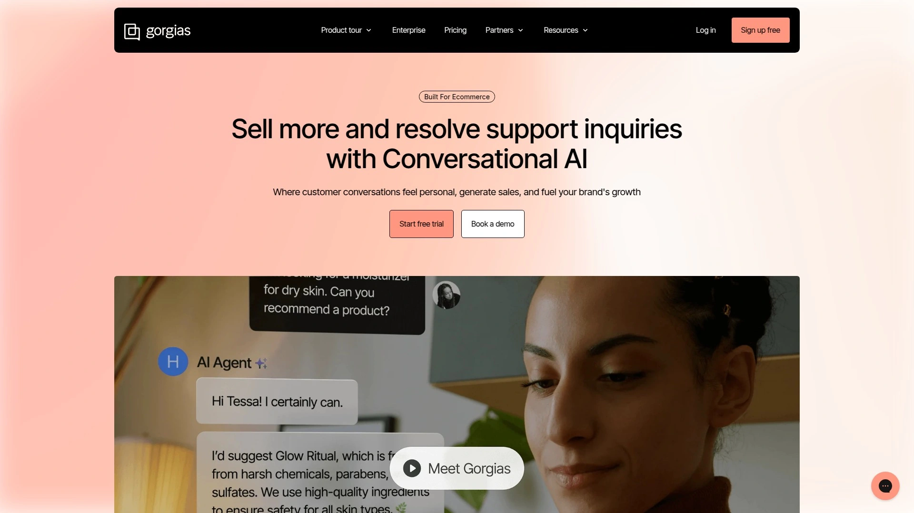

Gorgias specializes in e-commerce support, integrating natively with Shopify, BigCommerce, Magento, and WooCommerce to surface order data, customer purchase history, and shipping information directly in ticket views. Agents can process refunds, cancel orders, edit customer information, and handle returns without leaving the support interface, eliminating the constant platform switching that slows e-commerce support.

The platform uses over 35 Shopify variables to personalize responses automatically—insert customer names, order numbers, tracking links, and product details dynamically into replies. Rules engine auto-tags, routes, and prioritizes tickets based on conditions you define, like flagging high-value customers or rush shipping issues. Macros create templated responses for common questions about shipping, returns, and product details.

AI Agent handles routine conversations end-to-end, resolving up to 60% of standard inquiries from email and chat channels. It learns from your help center and internal policies without requiring coding, understanding context well enough to handle multi-turn conversations. For product recommendations and sales, the AI suggests products, applies discounts, and answers pre-purchase questions that convert browsers into buyers.

Revenue attribution shows which support interactions lead to purchases, treating customer service as a revenue channel rather than pure cost center. Integration with loyalty programs, review platforms, and e-commerce tools creates comprehensive workflows. Pricing charges per ticket resolved rather than per agent, letting you scale teams without proportional cost increases. For Shopify stores and e-commerce brands where support and sales intersect constantly, Gorgias builds workflows that generic help desks can't match.

## **[Help Scout](https://helpscout.com)**

Shared inbox platform emphasizing simplicity and customer-first support with email, live chat, knowledge base, and messaging without overwhelming complexity.

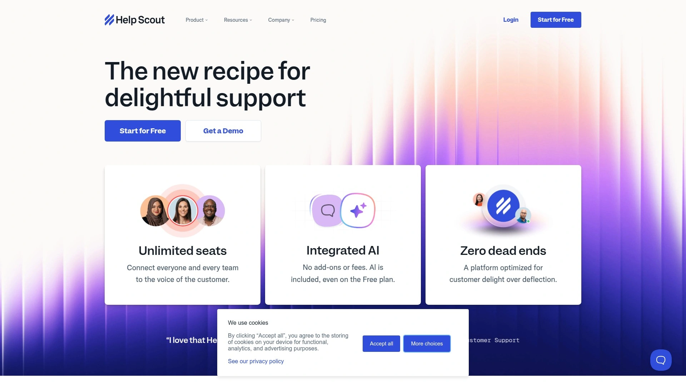

Help Scout targets teams wanting capable support tools without enterprise-level complexity. The shared inbox handles email support with features like collision detection preventing duplicate replies, saved replies speeding common responses, and assignments distributing work across team members. The interface stays clean and focused rather than cluttered with advanced features most teams never use.

Beacon widget combines live chat, knowledge base search, and contact forms in one interface that adapts based on customer needs. When customers type questions, it suggests relevant help center articles before connecting them to agents, deflecting tickets through self-service. Messaging enables asynchronous conversations that customers can start and return to without staying connected.

The knowledge base builder creates self-service resources with categories, articles, and search functionality. Simple analytics show which articles get viewed most and where customers still need help. Customer profiles aggregate all previous conversations and relevant data, giving agents context for personalized support.

The AI features draft replies, improve existing responses, summarize conversations, and deliver quick answers from knowledge bases. Automation workflows handle repetitive tasks, though they're simpler than advanced help desk automation. Integration with 50+ apps covers common business tools without overwhelming choice. Setup takes under an hour for basic configuration.

Pricing scales predictably per agent without surprise add-on fees for core features. The platform works well for teams of 5-50 agents wanting human-centric support tools that don't require dedicated administrators or technical expertise. Larger enterprises needing complex routing or advanced reporting might outgrow its intentional simplicity.

## **[Front](https://front.com)**

Collaborative inbox treating emails, messages, and comments as team conversations with transparent workflows and powerful integrations.

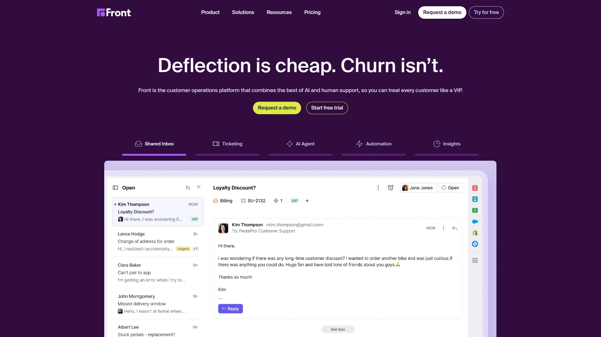

Front reimagines email as collaborative workspace where teams coordinate customer communications transparently. The shared inbox shows all messages across channels—email, SMS, chat, social media—with team comments visible inline so everyone knows who's handling what and what's been discussed internally. This transparency reduces duplicate work and coordination overhead.

Assignments and workflows distribute conversations systematically, routing based on rules or letting team members claim messages from shared views. Automated replies and templates handle routine responses while maintaining personal touch through variable insertion. The platform integrates deeply with business tools, embedding relevant context from CRMs, project management, and other systems directly in conversation views.

Analytics track team performance, individual productivity, response times, and customer satisfaction. The rules engine automates tagging, assignments, and actions based on conditions you define. Collaborative features like message sharing, internal discussions, and team mentions keep everyone informed without leaving the inbox.

Mobile apps enable teams to handle customer communications from anywhere. The platform emphasizes collaboration and transparency over traditional ticket-based workflows, working well for teams where multiple people need visibility into customer conversations and internal coordination matters as much as customer responses.

Setup and learning curve exceed simpler tools like Help Scout, and pricing reflects the collaboration focus. For internal operations teams, account management groups, and support teams where transparency and collaboration matter more than ticketing formality, Front creates workflows that traditional help desks don't support.

## **[LiveAgent](https://liveagent.com)**

Multi-channel help desk combining ticketing, live chat, call center, and social media support with competitive pricing and extensive features.

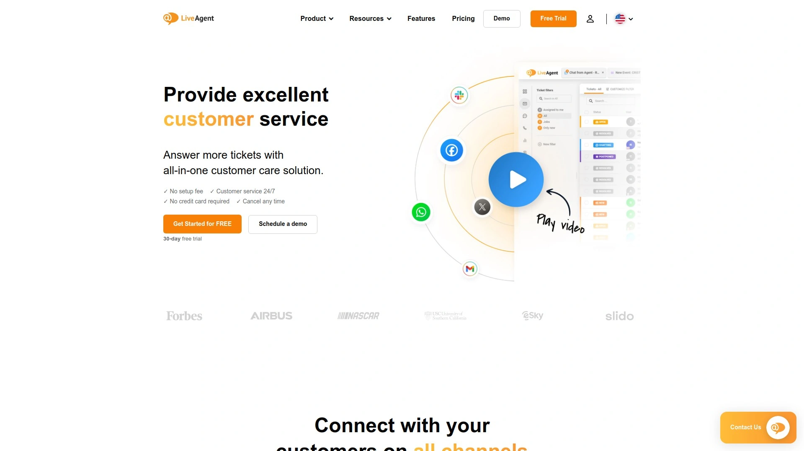

LiveAgent consolidates email, live chat, phone, Facebook, Twitter, Instagram, and contact forms into unified ticketing. The platform positions itself as an all-in-one solution including features that competitors often charge separately for—built-in call center functionality, video calls, and extensive channel coverage without add-on costs.

The ticketing system converts all customer interactions into manageable tickets with status tracking, assignments, tags, and filtering. Live chat includes proactive chat invitations, canned responses, typing previews, and chat distribution rules. Call center features provide IVR, unlimited call recording, call transfers, and callback scheduling integrated with ticket management.

Automation rules trigger actions based on conditions—auto-assign tickets, send canned responses, change statuses, or notify team members. The knowledge base creates self-service resources reducing agent workload. Gamification features motivate agents through badges and recognition for performance metrics.

Time tracking measures agent productivity and ticket resolution duration. Reporting covers customer satisfaction, agent performance, ticket statistics, and channel analytics. API and webhooks enable custom integrations beyond the 200+ native app connections. The interface looks dated compared to modern alternatives, but functionality remains comprehensive.

Pricing undercuts many competitors—the mid-tier plan costs significantly less than comparable Zendesk or Intercom tiers while including more channels and features out of the box. Free trial allows full testing before commitment. For cost-conscious teams needing omnichannel support including voice without premium pricing, LiveAgent delivers substantial value despite interface age.

## **[Kustomer](https://kustomer.com)**

CRM-powered customer service platform organizing interactions by customer timeline rather than individual tickets for relationship-focused support.

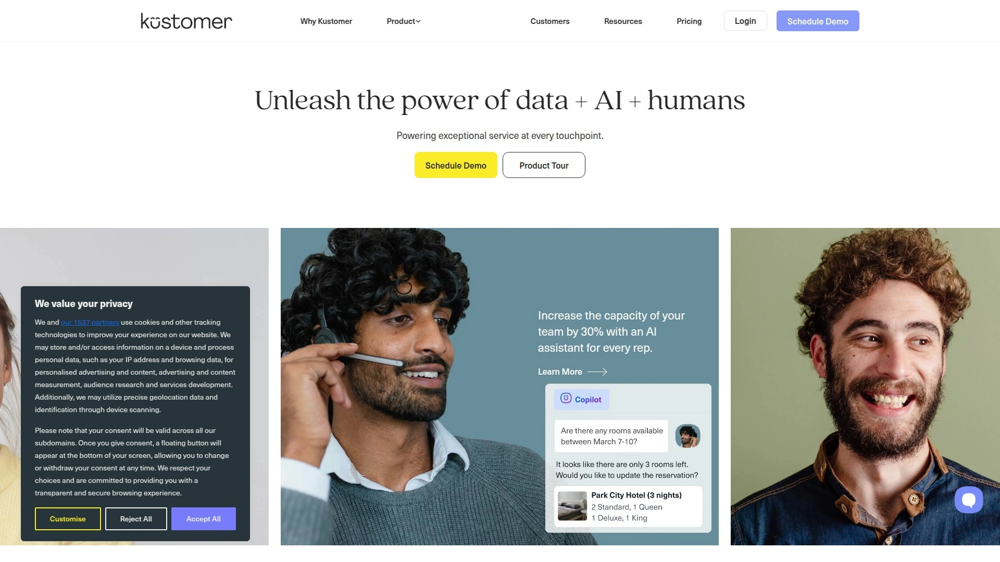

Kustomer structures support around customers rather than tickets, displaying complete relationship timelines showing all interactions, purchases, and context in unified views. This customer-centric approach helps agents understand the full story rather than treating each inquiry as isolated incident. The timeline aggregates data from multiple systems, creating comprehensive profiles.

The platform routes conversations intelligently across channels—email, chat, phone, SMS, social media—maintaining context as customers switch between channels. AI-powered automation handles routine inquiries, suggests responses to agents, and escalates complex issues appropriately. Business rules orchestrate workflows matching your support processes.

Deep integration with e-commerce platforms, CRMs, and business tools brings relevant data into agent views—order details, subscription information, billing history, and custom attributes. Agents can take actions like processing refunds or updating subscriptions directly from the platform. The insight cards display relevant data and suggested actions contextually.

Reporting dashboards track team performance, customer satisfaction, operational efficiency, and business metrics. The platform scales for enterprises managing high volumes across distributed teams. Implementation and pricing reflect enterprise positioning—expect longer setup cycles and costs higher than SMB-focused alternatives.

For companies prioritizing relationship continuity over transactional ticket resolution and needing tight integration between support and business data, Kustomer's customer-centric architecture aligns support workflows with modern customer expectations.

## **[Zoho Desk](https://zoho.com/desk/)**

Affordable multi-channel help desk with AI capabilities, extensive customization, and integration with Zoho's broader business suite.

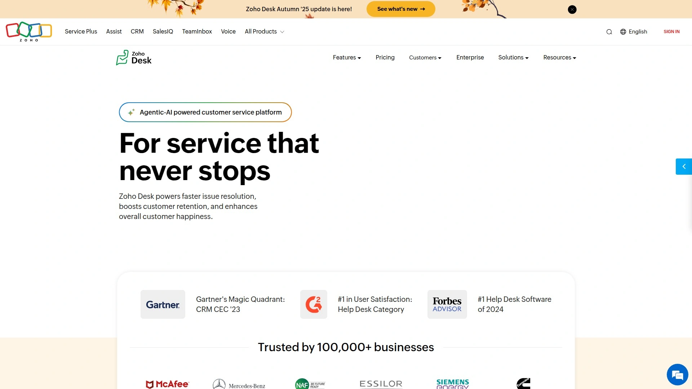

Zoho Desk delivers comprehensive help desk functionality at pricing below major competitors. The platform handles omnichannel support across email, phone, chat, social media, and web forms with unified ticketing. AI assistant Zia performs sentiment analysis, suggests responses, detects anomalies in ticket trends, and automates routine tasks based on historical patterns.

The ticket management system includes automated assignment, escalation rules, time tracking, SLA management, and collision detection. Blueprint feature creates custom workflows guiding agents through resolution processes step-by-step, ensuring consistency for complex procedures. Multi-department structure separates teams while enabling collaboration when issues span departments.

Knowledge base supports multiple help centers for different products or customer segments. Community forums enable peer-to-peer support, reducing agent workload for common questions. The mobile SDK lets you embed Zoho Desk functionality directly into mobile apps for in-app support.

Extensive customization options include custom fields, modules, layouts, and functions using Deluge scripting language. Integration with other Zoho products—CRM, Analytics, Projects—creates unified business workflows. Third-party integration via Zoho Marketplace and API covers external tools. Reporting and analytics provide operational insights with customizable dashboards.

The free plan supports three agents with basic features, making it accessible for very small teams testing helpdesk software. Paid plans scale affordably, making Zoho Desk competitive for budget-conscious teams needing solid features without premium pricing. For companies already using Zoho ecosystem, integration simplicity adds significant value.

## **[Tidio](https://tidio.com)**

Live chat and chatbot platform with customer service features designed for small businesses wanting affordable automation.

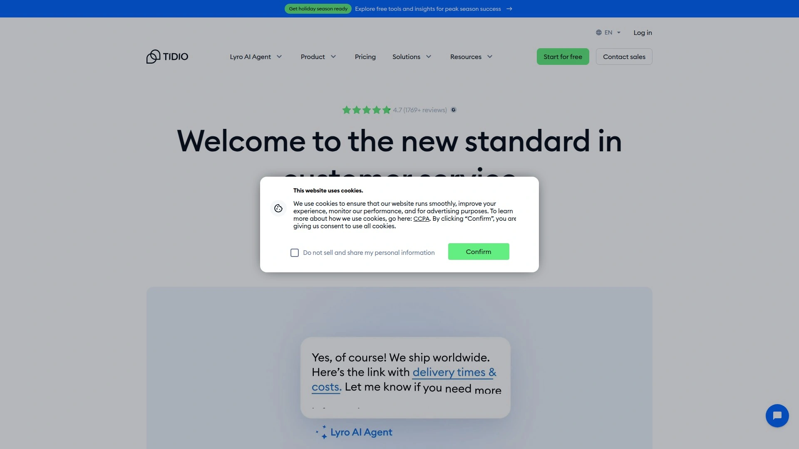

Tidio combines live chat, chatbots, and ticketing in one platform accessible to small businesses and startups. The visual chatbot builder creates automated conversation flows without coding—handle FAQs, qualify leads, collect information, and route to agents when needed. Pre-built templates accelerate bot creation for common scenarios.

Live chat integrates with websites quickly, enabling real-time conversations with visitors. The unified inbox consolidates messages from chat, email, Messenger, and Instagram into one view. Mobile apps let teams respond from anywhere. Visitor tracking shows who's on your site, what pages they're viewing, and their journey, enabling proactive engagement.

AI features include conversational AI that handles customer questions naturally, learning from interactions to improve responses over time. The platform analyzes sentiment and suggests responses, helping agents maintain appropriate tone. Email marketing features and abandoned cart recovery extend beyond pure support into sales enablement.

Integration with Shopify, WooCommerce, WordPress, and major platforms brings e-commerce data into conversations. Pricing starts remarkably low, with free tier including basic chat and email, and paid plans charging per conversation rather than per agent. This pricing model works well for small teams with moderate interaction volumes.

Setup takes minutes rather than hours—add chat widget to site, configure basic bot, and start responding. For small businesses, solopreneurs, and startups wanting chat and basic automation without help desk complexity or enterprise pricing, Tidio removes barriers to professional customer communication.

## **[Re:amaze](https://reamaze.com)**

Multi-brand helpdesk built for e-commerce with customer service, live chat, and chatbot features managing multiple storefronts from unified platform.

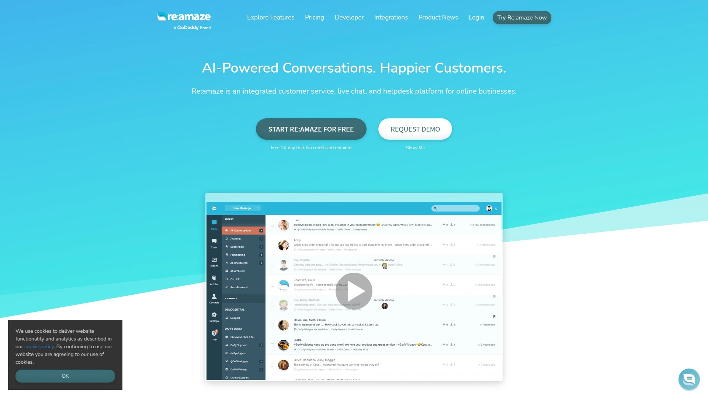

Re:amaze targets e-commerce businesses managing multiple brands or storefronts from centralized support operations. The platform handles email, live chat, social media, SMS, VOIP, WhatsApp, and push notifications in unified inbox. Deep integration with Shopify, BigCommerce, and WooCommerce surfaces order data, enabling agents to view, edit, create orders, process refunds, and update customer information within support conversations.

Chatbots and automated workflows add efficiency to support operations through conversation routing, auto-responses, and intent recognition. Marketing automation features create campaigns for promotions, cross-selling, upselling, and product announcements through chat. Proactive chat invitations engage visitors based on behavior, cart value, or page views.

Multi-brand support enables managing distinct customer experiences for different storefronts while centralizing agent operations. Staff can switch between brands seamlessly, applying appropriate branding and workflows contextually. Reporting shows performance across brands individually and collectively.

FAQ builder creates self-service resources embedded in chat widgets. Social media monitoring tracks brand mentions and conversations across platforms. Video chat and co-browsing features help resolve complex issues requiring visual demonstration. Push notification campaigns reach customers through browser notifications for marketing and transactional messages.

Pricing remains competitive for the feature depth, especially for businesses managing multiple brands where separate help desk licenses per brand would multiply costs prohibitively. For multi-brand e-commerce operations wanting unified support with marketing capabilities, Re:amaze delivers specialized workflows competitors lack.

## **[Richpanel](https://richpanel.com)**

E-commerce customer service platform with self-service portal, live chat, and helpdesk designed specifically for online stores.

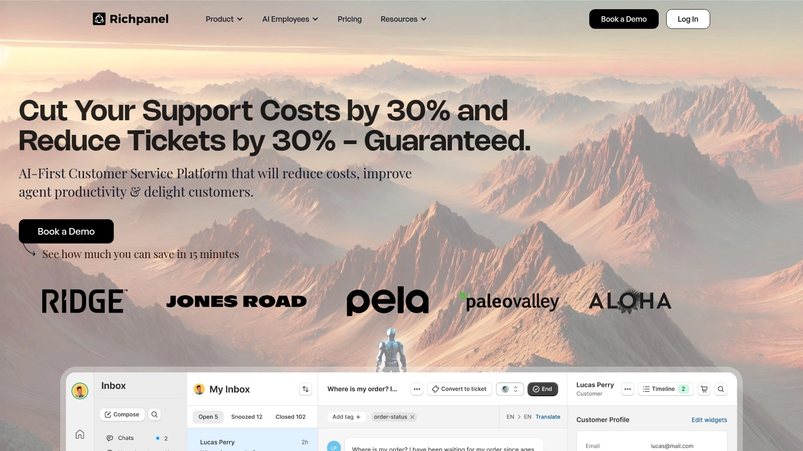

Richpanel focuses exclusively on e-commerce support, building features around common online retail workflows. The self-service portal enables customers to track orders, initiate returns, modify shipments, and resolve common issues independently without agent intervention. This automation handles routine post-purchase questions that consume significant support capacity.

Deep integration with Shopify, WooCommerce, and Magento displays rich customer profiles showing order history, lifetime value, previous conversations, and relevant data contextually. Agents take order actions—cancellations, refunds, returns—in one click without switching platforms. Live chat, email, phone, WhatsApp, and social media consolidate into unified inbox.

The platform includes automation bots, macros, and task automation reducing manual work. Collaboration tools enable agents to coordinate on complex issues. Reporting tracks metrics relevant to e-commerce—revenue impact, cart abandonment reduction, customer lifetime value changes correlating with support quality.

Pricing structure designed for e-commerce scales based on usage rather than fixed per-agent fees. The free tier provides basic functionality for testing. For online retailers where returns, shipping questions, and order modifications dominate support volume, Richpanel's self-service portal and e-commerce automation reduce workload substantially compared to general-purpose help desks.

## **[Crisp](https://crisp.chat)**

All-in-one customer messaging platform combining live chat, chatbots, knowledge base, and CRM for streamlined customer engagement.

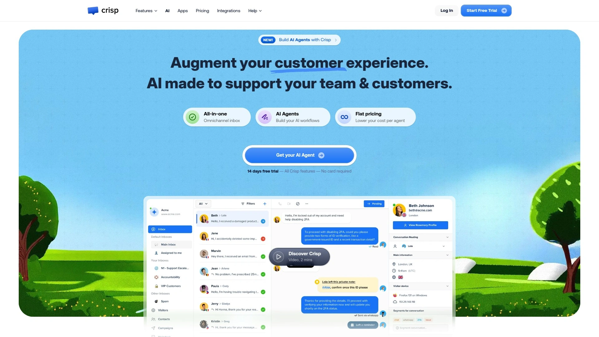

Crisp delivers live chat, shared inbox, chatbots, CRM, knowledge base, and status page in one platform. The messaging interface supports real-time chat, co-browsing for visual support, screen sharing, video calls, and audio calls directly within conversations. The shared inbox unifies messages from chat, email, Messenger, Twitter, SMS, and WhatsApp.

Chatbot builder creates automated conversation flows using visual interface without coding requirements. Triggers initiate conversations proactively based on visitor behavior, page visits, or time on site. The knowledge base provides self-service resources searchable by customers, with AI suggesting relevant articles during conversations.

CRM functionality tracks customer data, conversation history, segments, and attributes, creating comprehensive profiles informing personalized support. Campaign features send targeted messages to customer segments. Status page communicates service status and incident updates to customers transparently. Mobile apps enable agent responses from smartphones.

Integration marketplace connects to business tools extending functionality. Reporting covers conversation metrics, team performance, customer satisfaction, and operational analytics. Free tier includes unlimited chat history and basic features for small teams starting out. Paid plans add advanced automation, more agent seats, and premium features.

The interface emphasizes simplicity—clean design, intuitive navigation, minimal configuration required. For small to medium businesses wanting capable messaging platform without overwhelming feature complexity, Crisp balances functionality and usability effectively.

## **[Drift](https://drift.com)**

Conversational marketing and sales platform with live chat and AI-powered chatbots focused on lead generation and qualification.

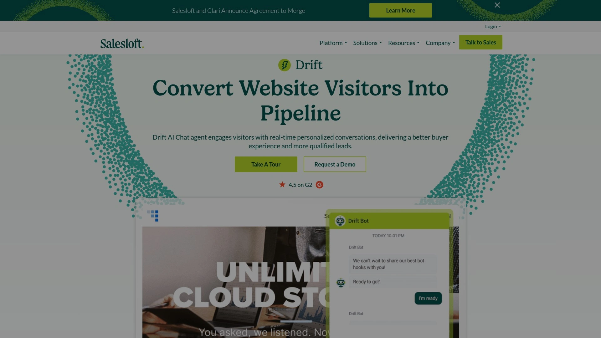

Drift specializes in conversational marketing and sales rather than traditional customer support. The platform uses chatbots and live chat to engage website visitors, qualify leads, book meetings, and route prospects to appropriate sales representatives. AI-powered bots handle lead qualification conversations, asking relevant questions and gathering information before connecting qualified prospects to sales teams.

Personalized messaging adapts based on visitor behavior, firmographics, and engagement history. Account-based marketing tools identify target accounts and trigger specialized playbooks when those visitors arrive. Video chat and voice messaging enable rich communication beyond text. Integration with Salesforce, HubSpot, and major CRMs ensures leads and conversation data sync seamlessly.

Email integration enables sales teams to continue conversations started in chat through email, maintaining continuity. The platform tracks engagement across channels, providing insights into buyer interest and intent. Playbooks create automated conversation flows for different scenarios—demo requests, pricing questions, product inquiries.

Custom pricing reflects enterprise positioning and sales focus. For customer support teams, Drift's sales-centric features may feel misaligned with support workflows. However, companies wanting to use chat primarily for lead generation, sales acceleration, and prospect engagement find Drift's specialized capabilities more relevant than support-focused alternatives. The platform works best when support and sales teams overlap, or when chat's primary purpose is revenue generation rather than customer service.

## **[Kayako](https://kayako.com)**

Customer service platform with unified customer timeline, multi-channel support, and collaboration tools for team-based support.

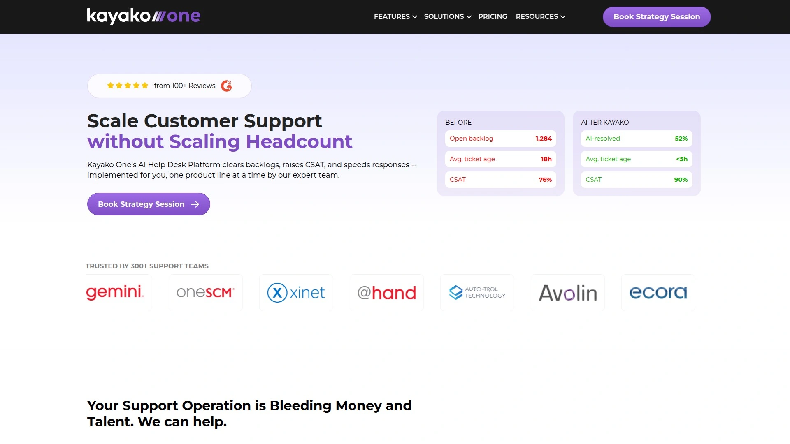

Kayako organizes support around customer timelines rather than disconnected tickets, aggregating all interactions into comprehensive views. This approach provides agents with context spanning the entire customer relationship rather than just current inquiry. The timeline includes emails, chats, calls, notes, and data from integrated systems.

Multi-channel support consolidates email, live chat, Twitter, Facebook, and help center inquiries into unified agent workspace. Smart routing distributes conversations based on agent skills, availability, and workload. Collision detection prevents multiple agents from responding simultaneously to same customer. Team collaboration features include internal notes, mentions, and case assignments.

Automation workflows handle repetitive tasks—auto-assign based on rules, send auto-responses, update statuses, and trigger escalations. The knowledge base creates self-service help centers with articles, categories, and search. Customer insights show satisfaction scores, interaction history, and relevant context. Reporting dashboard tracks team performance, response times, resolution rates, and customer feedback.

Integration options connect to CRMs, e-commerce platforms, and business tools. REST API enables custom integrations. Mobile apps provide agent access from smartphones. Pricing positions it mid-market, competing with tools like Help Scout and Freshdesk rather than enterprise platforms. For teams wanting customer-centric views without enterprise complexity, Kayako delivers focused functionality.

## **[Groove](https://groovehq.com)**

Simple shared inbox and knowledge base platform designed for small businesses wanting straightforward customer support tools.

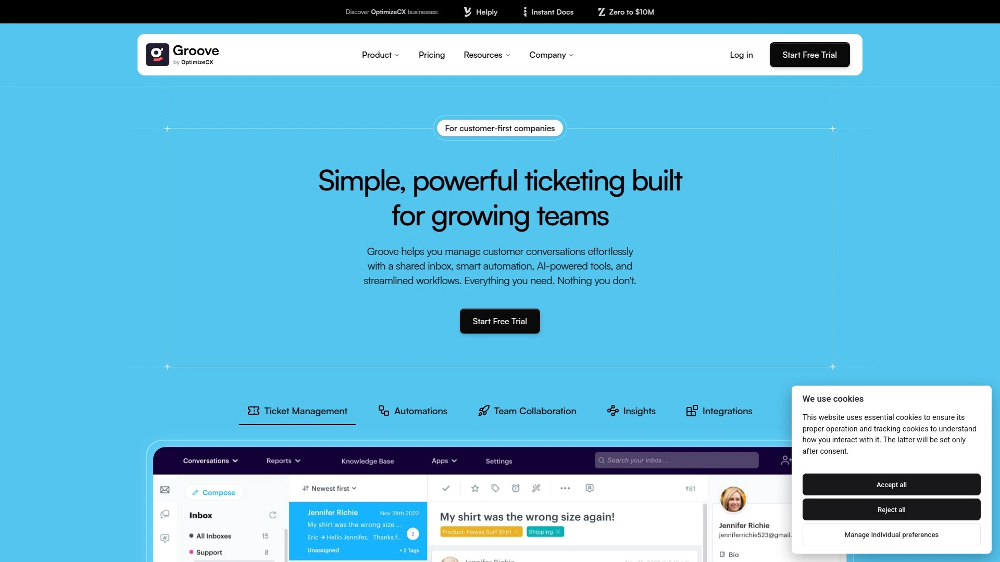

Groove strips help desk software to essentials, focusing on shared inbox and knowledge base without overwhelming features. The email-based support system lets multiple team members manage customer conversations from shared addresses, with assignments, collision detection, and internal notes preventing duplicate work. The interface resembles email rather than ticketing system, reducing learning curve.

Saved replies speed responses to common questions while maintaining personal touch through variable insertion. Rules engine automates assignments, tags, and actions based on conditions you define. Reporting shows response times, resolution rates, team productivity, and customer satisfaction. Knowledge base builder creates self-service help centers reducing support volume.

Integration with business tools covers common needs without extensive marketplace. The focus on simplicity means fewer features than comprehensive platforms, but also less complexity and faster setup. Pricing scales per user affordably for small teams. Free trial allows testing before commitment.

For very small businesses, startups, and teams under 10 people wanting email-based support without ticket formality or complex features, Groove's intentional simplicity removes barriers that enterprise platforms create. Growing teams or those needing live chat, phone support, or sophisticated automation may outgrow the focused feature set.

## **[HappyFox](https://happyfox.com)**

Help desk software with smart ticket routing, asset management integration, and extensive customization for IT and operations teams.

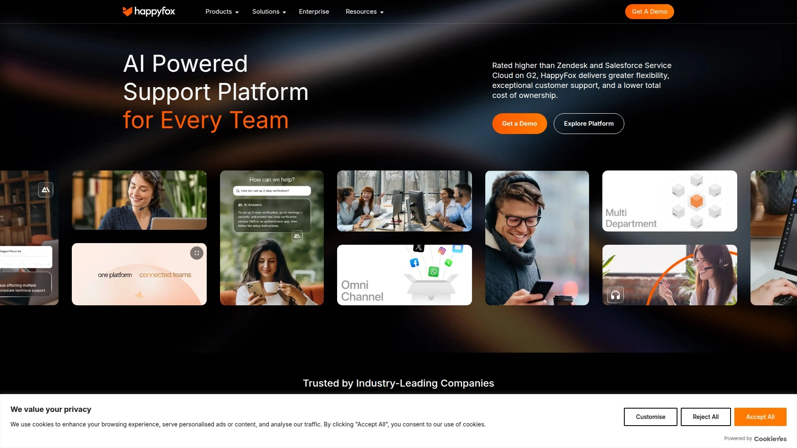

HappyFox delivers comprehensive ticketing with features appealing to IT help desks and operations teams. Smart ticket routing distributes requests based on agent skills, categories, priorities, and custom business rules. Asset management integration connects support tickets to specific hardware, software, or equipment, tracking issues by asset and maintenance history.

Multi-channel support handles email, phone, chat, web forms, and social media. Automated workflows streamline repetitive processes—escalations, approvals, notifications, and status updates. SLA management tracks compliance and alerts teams to approaching breaches. The knowledge base with community forums creates self-service resources.

Categorization and tagging organize tickets systematically, enabling detailed reporting on issue types, departments, and trends. Time tracking measures productivity and billable hours. Custom fields, ticket templates, and workflow customization adapt the platform to specific business processes. Robust API enables deep integration with business systems.

Reporting covers agent performance, ticket statistics, SLA compliance, and customer satisfaction. Multicurrency and multilingual support serves global operations. The platform scales from small teams to enterprise deployments. Pricing reflects feature depth, positioning it mid-to-upper market. For IT departments, facilities management, and operations teams where asset tracking and customizable workflows matter, HappyFox includes functionality that customer service-focused platforms lack.

## **[Sprout Social](https://sproutsocial.com)**

Social media management platform with customer service tools unifying social conversations for brands prioritizing social support.

Sprout Social approaches customer service through social media lens, consolidating messages from Facebook, Twitter, Instagram, LinkedIn, and other social platforms into unified Smart Inbox. For brands where social represents significant support channel, Sprout provides tools general help desks lack—social listening, engagement analytics, publishing workflows, and audience insights alongside support features.

The Smart Inbox categorizes and prioritizes inbound social messages, enabling teams to track, reply, and collaborate on conversations. Automated tagging and routing organize messages by topic, sentiment, or priority. Collision detection prevents duplicate responses across team members. Response templates speed replies while maintaining brand voice.

Integration with Salesforce Service Cloud connects social support to CRM data, giving agents customer context beyond social profiles. Reporting tracks response times, message volume, sentiment trends, and team performance specifically for social channels. The platform also handles social media publishing, content scheduling, and campaign analytics—capabilities extending beyond pure support.

The combined social management and customer service focus makes Sprout most valuable for brands treating social as primary support channel. Pure support teams without significant social presence might find focused help desks more appropriate. Pricing reflects the comprehensive social media management feature set. For marketing and support teams sharing social responsibility, Sprout unifies workflows both departments need.

## **[Olark](https://olark.com)**

Live chat software focusing on real-time website conversations with customization, automation, and visitor insights.

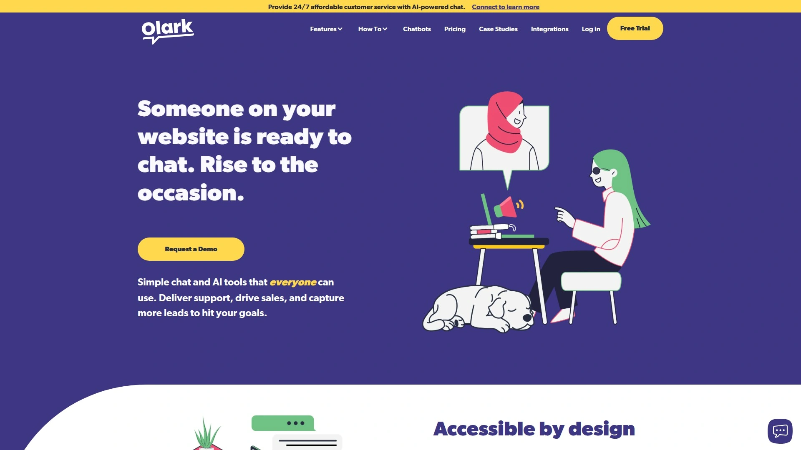

Olark provides live chat focused on real-time website conversations rather than comprehensive omnichannel support. The chat widget customizes to match website design and branding. Pre-chat forms collect visitor information before conversations start. Automated greetings trigger based on visitor behavior, page visits, or time on site.

Chat routing distributes conversations to available agents or specific departments based on rules you define. Transcripts save all conversations for reference and quality review. Visitor insights show who's on your site, what pages they're viewing, and their referral source, enabling context-aware support. Team management controls agent access, roles, and permissions.

Integration with help desk platforms, CRMs, and business tools extends functionality beyond standalone chat. Reporting tracks chat volume, response times, customer satisfaction, and conversion metrics. The searchable transcript archive helps identify common questions and improvement opportunities.

Pricing charges per agent with straightforward monthly costs. Setup simplicity gets chat operational quickly. For businesses wanting to add live chat to existing support operations without full help desk platform, Olark delivers focused chat functionality. Teams needing ticketing, knowledge bases, or multi-channel support should consider comprehensive platforms.

## **[Comm100](https://comm100.com)**

Omnichannel communication platform with live chat, ticketing, voice, and social media support emphasizing security compliance.

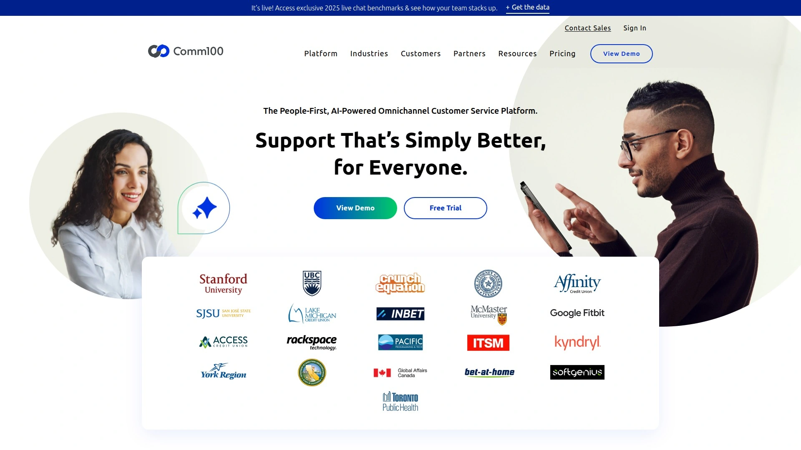

Comm100 combines live chat, ticketing, messaging, voice, video chat, knowledge base, and bots in enterprise-focused platform. Security and compliance emphasis includes data encryption, SOC 2 Type II certification, HIPAA compliance options, and on-premise deployment for organizations with strict data residency requirements.

AI-powered chatbots handle routine inquiries across channels, qualifying issues before agent handoff. The omnichannel routing intelligently distributes conversations across digital and voice channels based on agent skills and availability. Secure forms collect sensitive information with encryption and compliance controls.

Visitor monitoring tracks website activity enabling proactive engagement. Co-browsing and screen sharing help resolve complex issues visually. Queue management shows customers their position and estimated wait times. Historical reporting and real-time dashboards provide operational insights.

Integration options connect to CRMs, ticketing systems, and business applications. Multilingual support serves global operations. The platform scales for enterprise deployments with thousands of agents. Implementation typically involves longer setup cycles reflecting enterprise complexity. Pricing reflects comprehensive features and compliance certifications.

For regulated industries—healthcare, finance, government—where data security and compliance matter as much as functionality, Comm100's security focus and deployment flexibility address requirements that standard cloud platforms may not meet.

## **[Wix Answers](https://wix.com/answers)**

All-in-one customer care platform with ticketing, knowledge base, call center, and community forums from the Wix ecosystem.

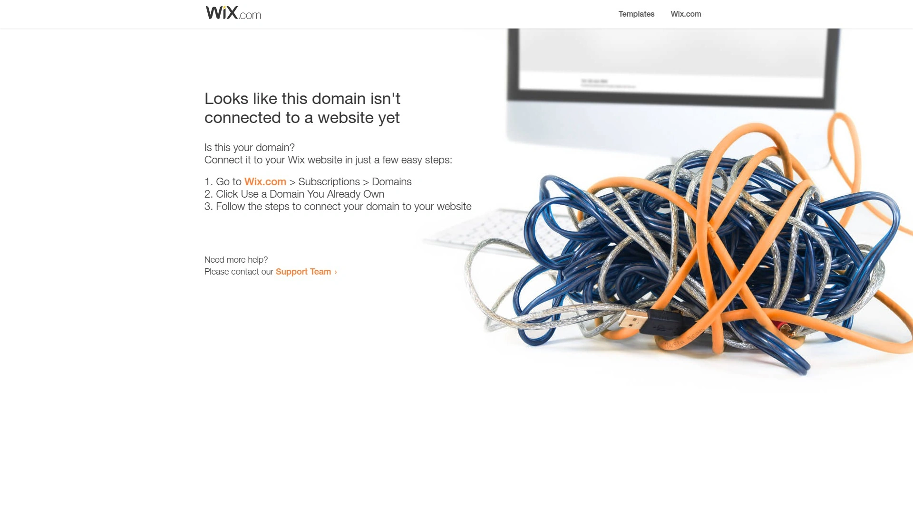

Wix Answers provides comprehensive customer care software distinct from Wix's website building tools. The platform includes ticketing across email and messaging channels, knowledge base creation, call center functionality, and community forums in integrated package. Agent workspace unifies all customer interactions with context and history.

Knowledge base builder creates self-service help centers with articles, categories, video content, and search. The integrated call center handles inbound and outbound voice with call routing, IVR, recording, and analytics. Community forums enable peer-to-peer support and customer engagement reducing agent workload.

Social media integration brings Facebook and Twitter conversations into unified workspace. Automation rules handle routing, assignments, and notifications. Reporting tracks ticket metrics, call statistics, knowledge base effectiveness, and team performance. The platform markets itself as covering contact center needs—ticketing, voice, and knowledge management—in one subscription.

Pricing aims below enterprise platforms while delivering more comprehensive features than basic help desks. Free trial enables testing full functionality. For companies wanting integrated voice, help desk, and knowledge base without assembling multiple tools, Wix Answers combines these elements affordably.

## **[Aircall](https://aircall.com)**

Cloud phone system with call center features integrating with help desk and CRM platforms for voice-focused support.

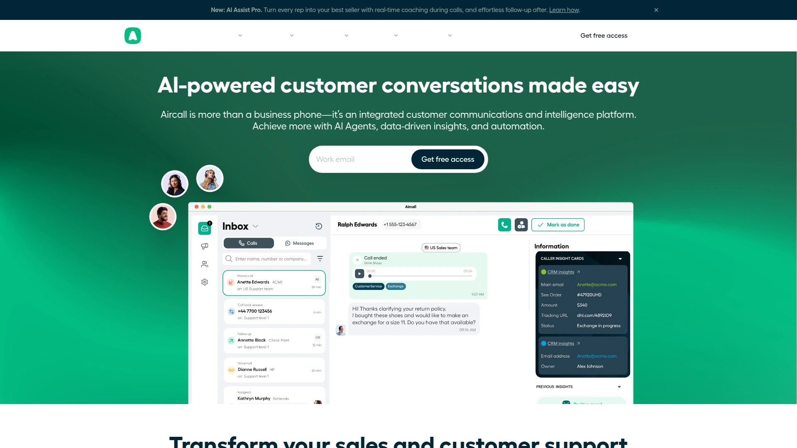

Aircall specializes in business phone systems rather than comprehensive help desk software, but integrates deeply with support platforms. The cloud phone system includes call routing, IVR, call queuing, warm transfer, conference calling, and voicemail. Real-time dashboards show call activity, queue status, and agent availability.

Integration with Zendesk, HubSpot, Salesforce, Intercom, and other platforms logs calls automatically as tickets and displays caller information from connected systems. Click-to-dial enables agents to call customers directly from CRM or help desk interfaces. Call tagging and notes capture context for follow-up.

Number management provides local, toll-free, and international numbers from 100+ countries. Mobile and desktop apps let teams make and receive business calls from any device. Call recording, monitoring, and whispering features support training and quality assurance. Analytics track call volumes, wait times, resolution rates, and agent performance.

For teams where voice support is significant channel, Aircall provides robust phone system that basic help desk voice features don't match. The integration approach works well for companies satisfied with existing help desk software but needing better voice capabilities. Pricing charges per user monthly. Teams wanting all-in-one platforms including basic voice might choose comprehensive help desks instead.

## **[Helpshift](https://helpshift.com)**

In-app customer support platform designed for mobile apps with messaging, bots, and issue resolution without leaving apps.

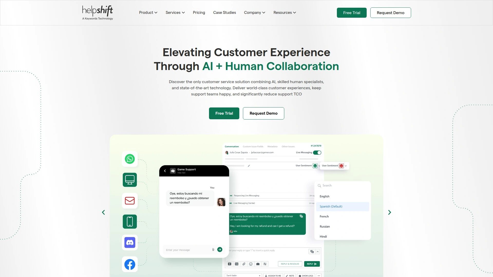

Helpshift specializes in mobile app support, embedding messaging, bots, knowledge base, and issue tracking directly within mobile applications. The SDK integrates into iOS and Android apps, enabling customers to get help without leaving the app experience. In-app messaging feels native to the app rather than redirecting to external support channels.

Bots handle common questions and workflows automatically—password resets, account issues, feature questions—before escalating to agents when needed. Contextual help surfaces relevant knowledge base articles based on user location within app. Issue tracking connects support conversations to app crashes, bugs, and technical problems with diagnostic data.

The dashboard provides agents with app usage data, device information, and relevant context alongside support conversations. Rich messaging supports images, videos, and interactive content. Proactive campaigns reach users in-app with targeted messages based on behavior or segments. Analytics track support metrics, issue trends, and bot performance.

Integration with analytics platforms, CRMs, and development tools creates workflows connecting support to product and engineering teams. For mobile-first companies, mobile games, and SaaS apps where in-app support experience matters for retention, Helpshift delivers specialized mobile support that web-focused platforms don't prioritize.

## **[Gladly](https://gladly.com)**

Customer service platform organizing all support around people rather than tickets, with conversation continuity across all channels.

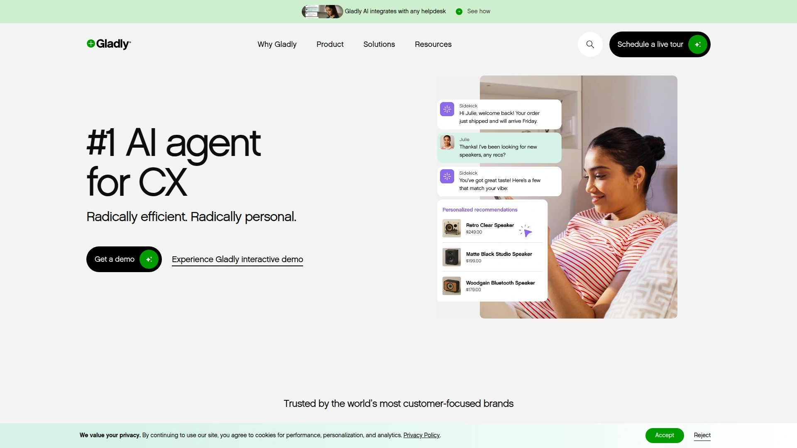

Gladly structures everything around customers instead of cases, treating support as ongoing relationship rather than discrete tickets. The customer timeline shows complete interaction history across voice, email, SMS, chat, and social media in chronological conversation thread. Agents pick up conversations seamlessly regardless of channel switches.

The radically simple interface removes ticketing complexity, showing agents who they're helping and the conversation history without navigating ticket queues. Channel switching maintains context—if a customer starts on chat then calls, agents see the chat history during the call. This continuity eliminates customers repeating themselves across channels.

Automation and workflows orchestrate routing, assist agents with suggestions, and handle routine tasks without fragmenting the customer view into discrete tickets. Deep integration with e-commerce, subscription, and business systems surfaces relevant data contextually. Reporting focuses on customer-centric metrics—conversation resolution, customer satisfaction, relationship health—rather than just ticket counts.

Implementation and pricing target mid-market to enterprise customers wanting to differentiate through superior support experiences. The architectural difference from ticket-based systems requires operational mindset shift. For brands competing on service quality and wanting seamless omnichannel experiences, Gladly's people-focused approach aligns with modern customer expectations better than traditional ticketing.

## **[Acquire](https://acquire.io)**

Digital customer engagement platform with co-browsing, video chat, and AI chatbots enabling visual support for complex issues.

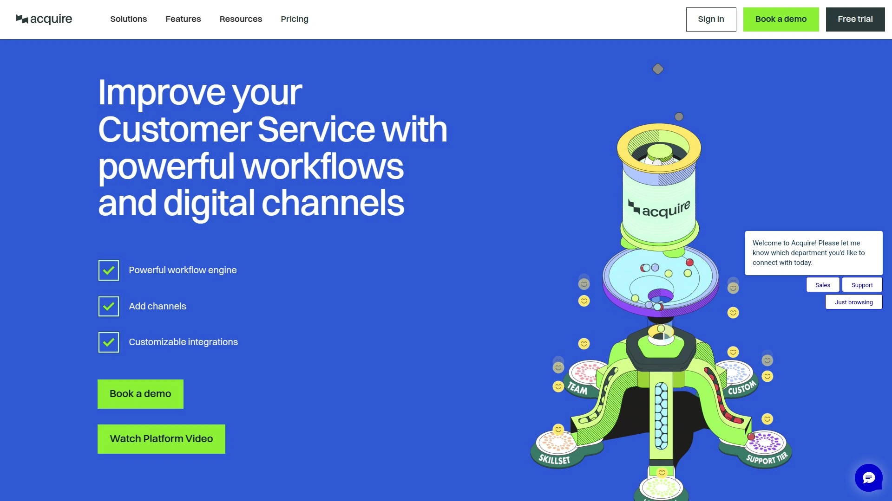

Acquire emphasizes visual support capabilities—co-browsing, screen sharing, and video chat—alongside standard messaging and chatbots. The co-browsing feature lets agents see customer screens and guide them through processes visually, dramatically improving resolution for technical or interface issues. Secure co-browsing protects sensitive information by masking specified form fields.

AI chatbots handle routine inquiries and qualify issues before routing to appropriate agents. Live chat unifies web and mobile conversations. The visual IVR guides customers through automated decision trees with graphical interfaces rather than voice prompts. Screen recording captures sessions for training and quality purposes.

Unified dashboard shows agents all customer interactions, integrated data from connected systems, and conversation context. Proactive chat triggers based on behavior, page visits, or cart abandonment. Integration with business tools extends data visibility. Analytics track engagement, resolution rates, customer satisfaction, and visual support effectiveness.

The visual support focus makes Acquire particularly valuable for technical support scenarios, SaaS onboarding, financial services, and situations where showing is more effective than telling. Teams primarily handling simple text-based support might not need the specialized visual capabilities. Enterprise pricing reflects the advanced feature set.

## FAQ

**How do I choose between standalone live chat tools and comprehensive help desk platforms?**

Start by mapping your actual support channels—if customers only contact you via email and occasional chat, a shared inbox like Help Scout or Groove might suffice. Teams handling phone, social media, SMS, and multiple channels need unified platforms like Zendesk or Freshdesk that consolidate everything. Also consider growth trajectory—tools that work for 5 agents often don't scale smoothly to 50 agents, so factor in where you'll be in 18 months, not just today.

**What makes e-commerce help desks different from general customer service platforms?**

E-commerce-focused platforms like Gorgias, Richpanel, and Re:amaze integrate directly with Shopify, WooCommerce, and similar platforms to surface order data, shipping information, and purchase history directly in support conversations. Agents can process refunds, cancel orders, and handle returns without switching between help desk and e-commerce admin. Self-service portals let customers track orders and initiate returns independently, deflecting routine post-purchase questions that consume significant capacity in online retail.

**Should I prioritize AI features when selecting customer service software?**

AI capabilities vary dramatically in usefulness—some platforms use AI to auto-suggest responses or summarize tickets, which genuinely speeds agent work, while others just slap "AI-powered" labels on basic automation. Focus on specific automation you need: Does the AI handle complete conversations end-to-end or just suggest canned responses? Can it actually resolve common issues without agent involvement? Test AI features during trials with your real support scenarios rather than trusting marketing claims about percentage improvements.

## Wrapping Up

The best customer service platform depends entirely on your specific situation—your channels, team size, industry, and whether you're prioritizing simplicity or comprehensive features. **[Zendesk](https://www.zendesk.com)** hits the versatility sweet spot for most growing teams by scaling smoothly from small operations to enterprise deployments while handling email, chat, phone, social, and messaging in one place with AI that actually reduces workload from day one. The unified agent workspace means your team isn't juggling five different tools to see complete customer context, and the extensive integration marketplace connects to whatever business systems you're already using without forcing platform switches that derail operations.
